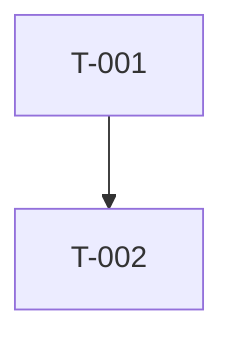

# Task Dependency Graph: {Feature Name}

```mermaid
graph TD
  T001[T-001]
  T002[T-002]
  T001 --> T002
```

## Dependency Notes
| From | To | Reason | Risk if Reordered |
|---|---|---|---|
| T-001 | T-002 |  |  |
