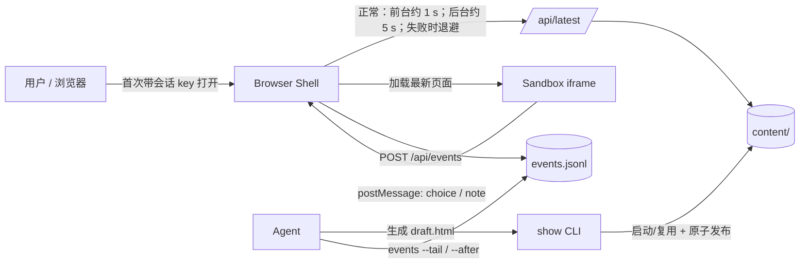
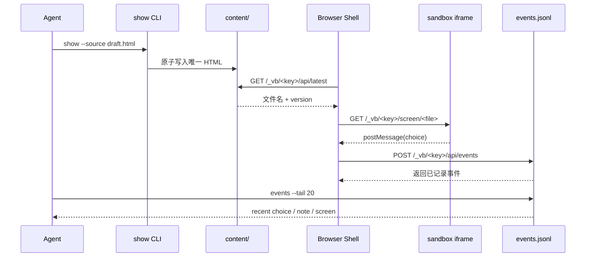

# 架构说明

## 1. 组件关系



## 2. 责任边界

### Agent

- 判断问题是否值得视觉化；
- 处理用户同意；
- 生成 HTML、CSS、SVG；
- 发布页面；
- 读取结构化事件；
- 把选择写回项目文档。

### `companion.py`

- 创建会话目录和随机密钥；
- 启动本地 HTTP 服务；
- 查找最新页面；
- 包装 HTML 片段或注入交互助手；
- 限制本地文件访问范围；
- 记录选择与备注；
- 管理状态、空闲自动关闭和停止。

### Browser Shell

实现资源位于 `assets/browser-shell.html`、`assets/browser-shell.css` 和 `assets/browser-shell.js`，可在不修改服务端代码的情况下换品牌或调整布局。

- 从首次 URL fragment 读取 key，并保存在当前 origin/tab 的 `sessionStorage`；
- 通过 path capability 请求受保护资源；
- 轮询最新页面；
- 在 sandbox iframe 中加载内容；
- 接收 iframe 的有限 `postMessage`；
- 统一提交事件并显示记录结果。

### 注入助手

`assets/injected-helper.css` 与 `assets/injected-helper.js` 负责键盘选择、选中状态、备注提交和受控 `postMessage`。

### Agent 生成页面

- 只负责视觉内容；
- 不负责管理或持久化会话密钥；
- 不直接调用事件 API；
- 用 `data-choice`、`data-label`、`data-detail` 声明选择。

## 3. 发布与选择时序



## 4. 为什么使用外层 Shell

外层 Shell 提供稳定的会话控制层：

- Agent 页面不需要知道端口和密钥；
- 页面更新不会重建整个浏览器会话；
- 事件提交逻辑集中在一个受控位置；
- 页面可以是任意片段或完整 HTML；
- 用户可以清楚看到连接状态和事件是否记录成功。

## 5. 为什么 iframe 不直接写事件

Agent 生成的页面位于不带 `allow-same-origin` 的 sandbox iframe 中：

```html
<iframe sandbox="allow-scripts">...</iframe>
```

因此：

- 页面可运行点击助手；
- 页面不能读取父页面 DOM；
- 页面不能读取父页面 DOM 或 `sessionStorage`；
- 页面通过有限的 `postMessage` 发送选择；
- 外层 Shell 才能写入事件接口。

这不是用于运行任意恶意互联网内容的完整安全沙箱，但能清晰分离“视觉内容”和“会话控制”。

## 6. 会话与数据目录

```text
PROJECT_ROOT/.visual-brainstorming/
├── .gitignore
├── .launch.lock
├── .server.lock
├── current.json
└── sessions/
    └── <session-id>/
        ├── content/
        │   └── *.html
        └── state/
            ├── session-key
            ├── server-info.json
            ├── launcher.json
            ├── launch-error.json
            ├── server.log
            ├── events.jsonl
            └── server-stopped.json
```

- `content/`：发布页面和本地资源；
- `state/session-key`：随机会话密钥；
- `state/events.jsonl`：追加写事件；
- `current.json`：当前项目会话指针；
- `.launch.lock` / `.server.lock`：持久 metadata 文件；通过进程退出自动释放的 OS advisory lock（加同进程 thread lock）分别串行化启动、清理和单实例服务，不通过删除 stale 文件抢锁；
- `server.log`：脱敏且有 256 KiB 上限的诊断日志，不记录 routine HTTP access line。

该目录用于临时协作，会自动写入 deny-all `.gitignore`，默认不应提交 Git。

## 7. 关键实现选择

### 快路径与原子发布

正常 Agent 路径使用 `show`，把“启动或复用服务、发布页面、请求打开浏览器”合并为一次命令。底层 `publish` 仍先写临时文件，再通过 `os.replace` 生成唯一目标文件，避免浏览器读取到半写入页面。

### 最新页面判定

服务只扫描当前会话 `content/` 下的 `.html/.htm` 文件，并根据修改时间与文件名选择最新项。

### 会话密钥

首次 URL 把随机 key 放在 fragment 中；Browser Shell 将其保存在当前 origin/tab 的 `sessionStorage`，清理地址栏，并用 `/_vb/<key>/...` path capability 维持会话。旧 query URL 只作为兼容输入，Cookie 不作为凭据。CLI 的控制 URL 仍限制为本机回环地址并使用 query key；`/api/session` 不向浏览器回显 key 或 `control_url`，后台启动输出也不会把 key 写进日志。每个画面版本从 session key 派生独立 bridge，用于把 iframe 事件绑定到当前画面；它不是把自定义页面脚本视为不可信代码的秘密边界。

### JSONL

每个事件一行，便于：

- 追加写；
- 人工检查；
- 增量读取；
- 不依赖数据库；
- 保留简单历史。

## 8. 文件访问边界

`/screen/` 和 `/files/` 拒绝：

- `..` 路径穿越；
- 点文件和点目录；
- 符号链接；
- 当前会话 `content/` 之外的目标；
- 非 HTML 的 `/screen/` 请求；
- 通过 `/files/` 读取 HTML 文档。

## 9. 生命周期与运行资源

后台服务以 Python `-I -S` 隔离模式启动，不继承用户级 site 包和常见启动钩子。默认连续 2 小时没有实际画面/辅助资源加载或用户事件时，watchdog 会停止服务；bootstrap、轮询和健康检查不保活，`--idle-timeout 0` 可禁用。

`/api/latest` 轮询、健康检查和只读事件查询不会刷新活动时间。因此，一个无人使用但仍打开的浏览器标签页不会仅靠轮询让服务无限存活；发布新画面后 iframe 加载页面、或用户提交选择/备注时会重新计时。

## 10. 可替换部件

| 当前实现 | 可替换为 | 代价 |
|---|---|---|
| HTTP 短轮询 | WebSocket / SSE | 增加连接状态与重连逻辑 |
| JSONL | SQLite | 增加 schema 和迁移 |
| 本地 content 目录 | 对象存储 | 需要重新设计身份和访问边界 |
| HTML / SVG | Canvas / WebGL | 增加渲染和可访问性复杂度 |
| 单用户 | 多用户 | 需要身份、冲突和协作模型 |

## 11. 非目标

- 公网部署；
- 多用户同时编辑；
- 自动操作目标业务网站；
- 无限历史版本管理；
- 正式设计系统或原型平台；
- 读取模型隐藏推理。
